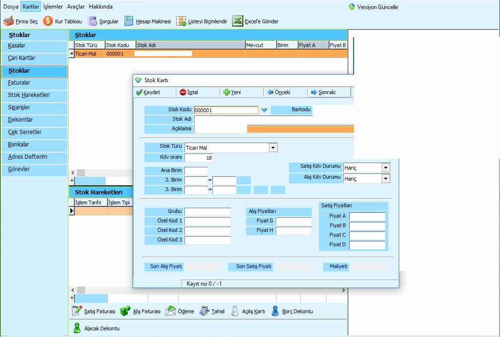

# Pre-Accounting Automation (ASP.NET MVC 5 / C# Forms App (.NET Framework)) - TERM PROJECT - OVER +20 TABLES
  
## Table of Contents

1. [Project Overview](#project-overview)
2. [Features](#features)
    1. [Extensive Database and Feature Set](#extensive-database-and-feature-set)
    2. [Core Accounting Functions](#core-accounting-functions)
        - Income and Expense Tracking
        - Invoice Generation
        - Payment Monitoring
    3. [Inventory and Customer Management](#inventory-and-customer-management)
        - Stock Tracking
        - Purchase Orders
        - Customer Information
    4. [Reporting and Analysis](#reporting-and-analysis)
        - Income Statements
        - Cash Flow Reports
        - Performance Reports
    5. [User Roles and Security](#user-roles-and-security)
3. [Technologies Used](#technologies-used)
4. [Setup Instructions](#setup-instructions)
    1. [Prerequisites](#prerequisites)
    2. [Installation Steps](#installation-steps)
    3. [Database Setup](#database-setup)
5. [Usage](#usage)
    1. [Example Usage](#example-usage)
6. [Future Improvements](#future-improvements)
7. [License](#license)

## Project Overview

The **Pre-Accounting Automation** project is a comprehensive software solution designed to streamline pre-accounting tasks, automate financial record-keeping, and provide critical financial insights. Developed using **ASP.NET MVC 5** and **C# Forms App (.NET Framework)**, the application features a robust database structure, extensive functionalities, and various reporting capabilities.

## Features

### 1. **Extensive Database and Feature Set**
The system utilizes a database with **27 tables** designed to handle various financial and business operations. This includes support for tracking transactions, customer data, purchase orders, inventory, and more. The application provides several feature windows to manage and view essential data.

### 2. **Core Accounting Functions**
#### - **Income and Expense Tracking**
Tracks all income and expenses with real-time updates, helping users stay on top of their financial activities.
#### - **Invoice Generation**
Automatically generates invoices for sales and purchases, ensuring accurate and timely billing.
#### - **Payment Monitoring**
Monitors payments, including due dates, amounts, and outstanding balances, helping users manage cash flow efficiently.

### 3. **Inventory and Customer Management**
#### - **Stock Tracking**
Manage and monitor inventory levels to prevent shortages or excess stock.
#### - **Purchase Orders**
Create and manage purchase orders with suppliers to ensure timely procurement of goods.
#### - **Customer Information**
Maintain a comprehensive database of customer details, including order history and contact information.

### 4. **Reporting and Analysis**
Financial reporting is a key component of the application. It includes:
#### - **Income Statements**
Automatically generate detailed income statements to track revenues and expenses.
#### - **Cash Flow Reports**
Analyze cash inflows and outflows to assess financial health.
#### - **Performance Reports**
Generate reports to evaluate the performance of various financial activities over time.

### 5. **User Roles and Security**
A **role-based authorization system** is implemented to ensure that only authorized users can access certain features. The system allows administrators to assign specific tasks and permissions to users, preventing unauthorized access and enhancing security.

## Technologies Used

- **Programming Languages**: C#, SQL
- **Frameworks**: ASP.NET MVC 5, .NET Framework
- **Database**: SQL Server (27 Tables)
- **Reporting**: Custom Reports and Data Analysis
- **Tools & Libraries**: 
  - Entity Framework
  - ADO.NET for database communication
  - Role-based security system
  - Custom reporting functions for financial data

## Setup Instructions

### 1. **Prerequisites**
Before setting up the project, make sure you have the following installed:
- Visual Studio with ASP.NET MVC 5 support
- SQL Server (or an equivalent RDBMS)

### 2. **Installation Steps**

1. **Clone the repository** or download the project files.
2. Open the project in **Visual Studio**.
3. Ensure that the correct **SQL Server connection string** is set in the `web.config` file to point to your local or remote database instance.
4. Build the solution and run the application.

### 3. **Database Setup**

1. **Database Creation**: Create a database and restore the provided **SQL Scripts** to populate the tables.
2. **Table Structure**: The database includes 27 tables that store all the required information for accounting, inventory, and customer management.

## Usage

Once the application is running, users can interact with the system through a simple and intuitive UI. The primary functions can be accessed via the main dashboard:
- Manage accounting records (income/expense).
- Generate invoices and monitor payments.
- Track inventory and customer information.
- View financial reports.

### Example Usage

1. **Track an Income**: Navigate to the "Income" section, enter the amount, and save the entry. The system will automatically update the cash flow.
2. **Generate an Invoice**: Go to the "Invoices" section, select the customer and items, and generate the invoice.

## Future Improvements

- Integration with external payment gateways for payment monitoring.
- Enhanced reporting capabilities, such as real-time graphs and charts for better data visualization.
- Additional modules for more advanced accounting functions, such as tax calculation and payroll management.

## License

This project is licensed under the MIT License - see the [LICENSE](LICENSE) file for details.
